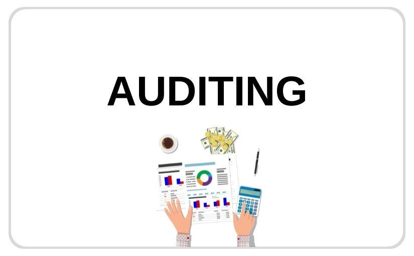

# Auditing

Auditing lưu lại thông tin của người tạo, thời gian tạo, người sửa cuối cùng, thời gian sửa cuối cùng. Nó vô cùng hữu ích cho việc truy xuất thông tin trong dự án 




in domain please extends `extends AuditTrail<String>`

```text
@Configuration
@EnableJpaAuditing(auditorAwareRef = "aware")
class JpaConfig {

    @Bean
    public AuditorAware<String> aware() {
//        Read username from token
        return new AuditorAwareImpl();
    // hard code return value of user id is Administrator
//        return () -> Optional.of("Administrator");
    }
}

@Service
public class AuditorAwareImpl implements AuditorAware<String> {

    @Autowired
    private WebUtil webUtil;
    @SneakyThrows
    @Override
    public Optional<String> getCurrentAuditor() {
        return Optional.of(webUtil.getToken());
    }
}

@MappedSuperclass
@EntityListeners(AuditingEntityListener.class)
public class AuditTrail<U> {
    @CreatedBy
    @Column(name = "created_by", updatable = false)
    private U createdBy;

    @CreatedDate
    @Column(name = "created_date", updatable = false)
    @Temporal(TemporalType.TIMESTAMP)
    private Date creationDate;

    @LastModifiedBy
    @Column(name = "last_modified_by")
    private U lastModifiedBy;

    @LastModifiedDate
    @Column(name = "last_modified_date")
    @Temporal(TemporalType.TIMESTAMP)
    private Date lastModifiedDate;
}
```

then when you work with data the history will save

