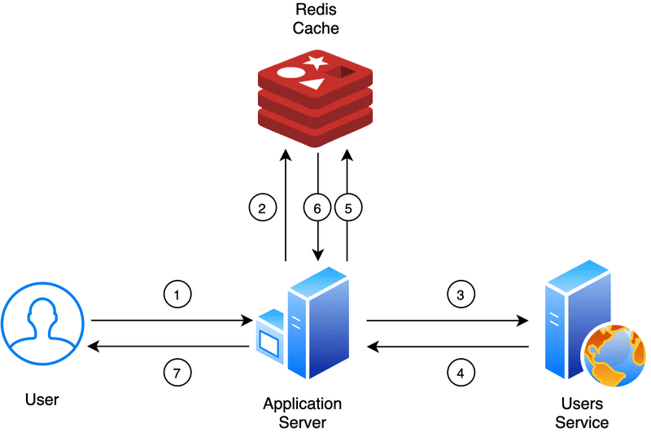
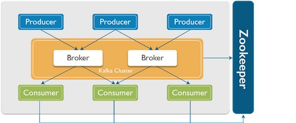

# REDIS

## Redis là gì? Tại sao phải dùng Redis?

Redis là tên viết tắt của Remote Dictionary Server (Máy chủ từ điển từ xa), đây là một kho lưu trữ dữ liệu dưới dạng key-value, trên bộ nhớ, mã nguồn mở, nhanh chóng.



## Ưu điểm

– Hoạt động lưu trữ key-value trên RAM cao.
– Cho phép phục hồi dữ liệu khi gặp sự cố nhờ việc lưu trữ dữ liệu trên đĩa cứng .
– Có khả năng phản hồi rất nhanh chỉ với vài mili giây để xử lý hàng triệu request mỗi giây.
– Tính năng sao chép đồng bộ giữa 2 cơ sở dữ liệu với nhau (replication) và tính năng cluster.


## Redis có các kiểu dữ liệu nào?
- String: là một trong những kiểu dữ liệu linh hoạt nhất redis. String là cấu trúc dữ liệu nhị phân và có thể lưu trữ đa dạng loại dữ liệu như số thập phân, ảnh JPEG, chuỗi,… Redis có thể làm việc với string hoặc từng phần của nó, đồng thời thực hiện tăng hay giảm các giá trị của float, integer.
- List: là một danh sách của strings, chứa tập hợp các phần tử chuỗi và được sắp xếp theo thứ tự insert. Redis có thể dễ dàng thêm một phần tử vào cuối hoặc đầu list. Vì việc truy xuất cực nhanh nên list rất phù hợp với các bài toán cần thao tác với nhiều phần tử gần đầu và cuối. Tuy nhiên việc thực hiện truy xuất các phần tử ở giữa list lại diễn ra rất chậm.
- Set: là tập hợp các string (đều không được sắp xếp). Redis có khả năng hỗ trợ các thao tác như đọc, thêm, xóa từng phần tử hay truy xuất, kiểm tra một phần tử xuất hiện trong tập hợp. Bên cạnh đó, redis còn hỗ trợ các phép tập hợp như lấy phần hợp, phần giao hay lấy phần khác nhau,…
- Hash: Việc lưu trữ hash table của các cặp key-value và trong đó các key được sắp xếp ngẫu nhiên, không theo bất kỳ thứ tự nào cả. Redis hỗ trợ các thao tác người dùng như đọc, thêm , xóa từng phần tử hoặc toàn bộ hash.
- Sorted set: là một danh sách được sắp xếp theo score, trong đó mỗi phần tử như là map của 1 string (member) và 1 floating-point number (score). Tương tự với set, redis cũng có thể thêm, xóa, đọc từng phần tử. Các phần tử của sorted set đều được sắp xếp theo thứ tự từ score nhỏ đến lớn.


```text
application.yml

spring:
  cache:
    type: redis
  redis:
    host: localhost
    port: 6379

@Configuration
@EnableRedisRepositories
public class RedisConfig {
    @Value("${spring.redis.host}")
    private String redisHost;

    @Value("${spring.redis.port}")
    private int redisPort;

// way 1: use jedis
    @Bean
    JedisConnectionFactory jedisConnectionFactory() {
        return new JedisConnectionFactory();
    }

    @Bean
    public RedisTemplate<String, Object> redisTemplate() {
        RedisTemplate<String, Object> template = new RedisTemplate<>();
        template.setConnectionFactory(jedisConnectionFactory());
        template.setDefaultSerializer(new GenericJackson2JsonRedisSerializer());
        template.setKeySerializer(new StringRedisSerializer());
        template.setHashKeySerializer(new GenericJackson2JsonRedisSerializer());
        template.setValueSerializer(new GenericJackson2JsonRedisSerializer());
        return template;
    }

// way 2: use lettuce
//    @Bean
//    public RedisConnectionFactory redisConnectionFactory() {
//    return new LettuceConnectionFactory();
//}
//    @Bean
//    @Primary
//    public RedisTemplate<String, Shopping> redisTemplate(){
//        RedisTemplate<String, Shopping> empTemplate = new RedisTemplate<>();
//        empTemplate.setConnectionFactory(redisConnectionFactory());
//        return empTemplate;
//    }
}
```


## Need: docker for windows

step 1: open cmd

docker-compose -f docker-compose.yml up -d

step 2: run postman

    ============================= WAY 1:=============================
    POST http://localhost:8080/create
    {
    "id": 1,
    "name": "shoping name 5",
    "price": 500
    }

    GET http://localhost:8080/get?id=1

    GET http://localhost:8080/check?id=1

    ============================= WAY 2:=============================
    POST http://localhost:8080/add
    {
        "id": 1,
        "name": "shoping name",
        "price": 100
    }

    GET http://localhost:8080/getAll


RedisInsight-v2

